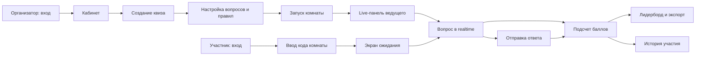
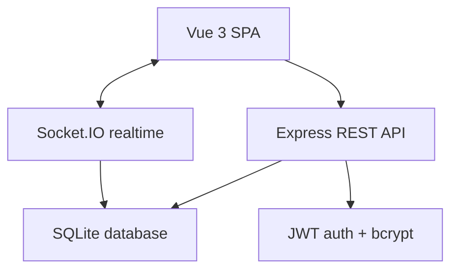
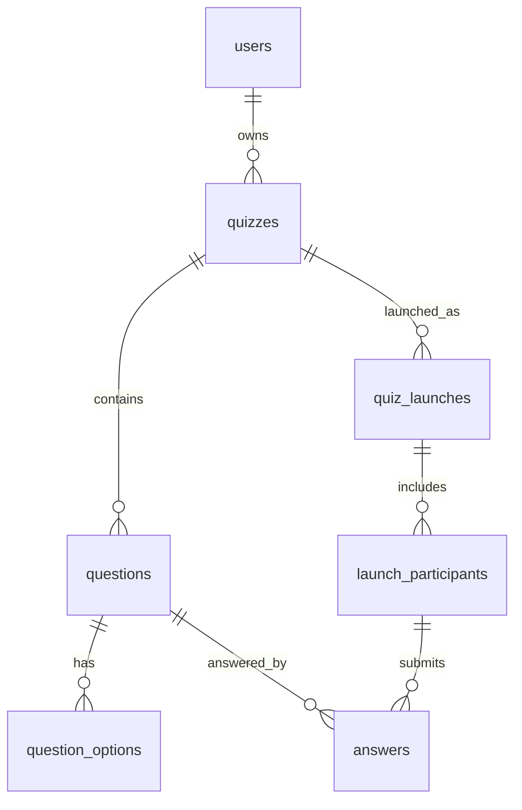

# Miro Board: структура доски для защиты проекта

Этот файл подготовлен как готовое содержание для переноса в Miro. После создания доски в Miro нужно вставить ссылку в README и пояснительную записку.

## 1. Цель продукта

QuizHub — веб-приложение для проведения интерактивных квизов на мероприятиях. Организатор создает квиз, запускает комнату, участники подключаются по коду и отвечают на вопросы в realtime.

## 2. Роли пользователей

Организатор:
- регистрируется и входит в кабинет;
- создает квиз;
- добавляет вопросы;
- настраивает правила;
- запускает комнату;
- управляет вопросами;
- смотрит лидерборд, аналитику и экспортирует результаты.

Участник:
- регистрируется и входит в кабинет;
- вводит код комнаты;
- ожидает старта;
- отвечает на вопросы;
- видит подтверждение ответа и итоговый лидерборд;
- смотрит историю участий.

## 3. User Flow

## 4. Архитектура

## 5. Модель данных

## 6. Экранная карта

- Главная страница
- Регистрация
- Авторизация
- Кабинет организатора
- Кабинет участника
- Конструктор квиза
- Вход по коду комнаты
- Live-панель ведущего
- Комната участника
- Режим администратора
- 404

## 7. Acceptance Criteria

- Пользователь может зарегистрироваться и войти.
- Организатор может создать квиз с вопросами разных типов.
- Участник может войти по коду комнаты.
- Вопрос появляется одновременно у ведущего и участников.
- Ответ принимается только во время активного вопроса.
- Баллы считаются автоматически.
- По окончании виден лидерборд.
- История сохраняется.
- Организатор может скачать CSV-результаты.
- Приложение запускается локально и через Docker Compose.

